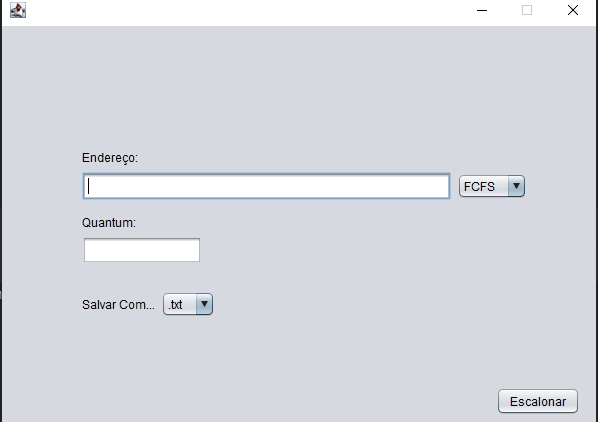

# Scheduling Simulator

Este projeto é um **simulador de escalonamento de processos**, desenvolvido para a disciplina de Estrutura de Dados I. O simulador implementa quatro algoritmos de escalonamento de processos:

- FCFS (First-Come, First-Served)
- SJF (Shortest Job First)
- Prioridade
- Round Robin

## Estrutura do Projeto
O projeto foi desenvolvido em Java e é organizado da seguinte forma:

- `src/algorithms`: Contém a implementação do algoritmo de ordenação.
- `src/entities`: Contém as entidades utilizadas no projeto.
- `src/schedulers`: Contém as implementações dos algoritmos de escalonamento.
- `src/utils`: Contém classes utilitárias para leitura e escrita de arquivos e diagrama de Gantt.
- `src/structures`: Contém as estruturas de dados utilizadas no projeto (Fila, pilha e lista encadeada).
- `src/SchedulerSimulator.java`: Classe principal do projeto.

## Critérios de Avaliação

1. **Aplicabilidade:** O projeto foi desenvolvido com foco na aplicação prática dos conceitos de estrutura de dados e algoritmos, simulando o escalonamento de processos em um sistema operacional.

2. **Vetor:** Aplicável para armazenar os processos a serem escalonados, pois a quantidade de processos é fixa e conhecida previamente.
   - [`src/utils/FileHandler.java`](https://github.com/lauramoroni/CPU-scheduling/blob/main/src/utils/FileHandler.java)
   ```java
   Processes[] processes = new Processes[n];
   // code ...
   processes[i] = new Processes(id, arrivalTime, burstTime, priority);
   ```

3. **Matriz:** Aplicável para a geração do diagrama de *Gantt*, pois é possível representar o tempo de execução de processo em cada unidade de tempo.
   - [`src/utils/GanttDiagram.java`](https://github.com/lauramoroni/CPU-scheduling/blob/main/src/utils/GanttDiagram.java)
   ```java
   String[][] diagram = new String[size][totalTime];
   // code ...
   diagram[processIndex][currentTime + j] = Color.ANSI_PURPLE_BACKGROUND + " " + Color.ANSI_RESET;
   ```

4. **Generics:** Aplicável para a implementação das estruturas de dados `QueueList`, pois permite a reutilização da fila para armazenar tanto `Processes` quanto `ProcessControlBlock`.
   - [`src/structures/queue/QueueInterface.java`](https://github.com/lauramoroni/CPU-scheduling/blob/main/src/structures/queue/QueueInterface.java)
   ```java
   public interface QueueInterface <T> {
      void add(T p) throws Exception;
      T remove() throws Exception;
      T peek() throws Exception;
      boolean isEmpty();
      boolean isFull();
      void show() throws Exception;
   }
   ```
   - [`src/schedulers/RoundRobin.java`](https://github.com/lauramoroni/CPU-scheduling/blob/main/src/schedulers/RoundRobin.java)
   ```java
   QueueList<ProcessControlBlock> queue = new QueueList<>(processes.length);
   QueueList<Processes> readyQueue = new QueueList<>(processes.length);
   ```

5. **Arquivos:** Leitura e escrita dos processos a serem escalonados.
   - [`src/utils/FileHandler.java`](https://github.com/lauramoroni/CPU-scheduling/blob/main/src/utils/FileHandler.java)
   ```java	
   public class FileHandler {
      public static void Processes[] readFile(String path);
      public static void writeFile(String path, QueueList<Processes> processes, String scheduler, int quantum);
      public static void writeTxtFile(String path, QueueList<Processes> processes, String scheduler, int quantum);
      public static void writeCSVFile(String path, QueueList<Processes> processes, String scheduler, int quantum);
   }
   ```

6. **Lista Encadeada e Fila:** Implementação das estruturas de dados para armazenar os processos a serem escalonados.
   - [`src/structures/queue/QueueInterface.java`](https://github.com/lauramoroni/CPU-scheduling/blob/main/src/structures/queue/QueueInterface.java)
   ```java
   public interface QueueInterface <T> {
      void add(T p) throws Exception;
      T remove() throws Exception;
      T peek() throws Exception;
      boolean isEmpty();
      boolean isFull();
      void show() throws Exception;
   }
   ```

7. **Algoritmo de Ordenação:** Implementação do algoritmo de ordenação `MergeSort` para ordenar os processos de acordo com algum critério (tempo de chegada, prioridade e tempo).
   - [`src/algorithms/MergeSort.java`](https://github.com/lauramoroni/CPU-scheduling/blob/main/src/algorithms/MergeSort.java)
   ```java
   public static void mergeMain(Processes[] processes, String param) {
      if (param.equals("burstTime")) {
            mergeBurstTime(processes);
      } else if (param.equals("arrivalTime")) {
            mergeArrivalTime(processes);
      } else if (param.equals("priority")) {
            mergePriority(processes);
      }
   }
   ```

8. **Algoritmo de Busca:**  Implementação do algoritmo de `Busca Linear` para encontrar o próximo processo da fila de prontos.
   - [`src/structures/queue/QueueList.java`](https://github.com/lauramoroni/CPU-scheduling/blob/main/src/structures/queue/QueueList.java)
   ```java
   public T getNext(T p) {
      Node current = head;
      while( current.next != null )
      {
         if( current.data.equals(p) ) {
            return current.next.data;
         }
         current = current.next;
      }
      return null; 
   }
   ```

9. **Interação:** Interação com o usuário para escolha do algoritmo de escalonamento e formato de saída, além da visualização do diagrama de *Gantt*.

   [](https://github.com/lauramoroni/CPU-scheduling/blob/main/images/interaction.png)

## Como Executar

1. Clone o repositório.
   ```bash	
   git clone https://github.com/lauramoroni/CPU-scheduling.git
   cd cpu-scheduling
   ```
2. Compile o projeto.
   ```bash
   javac src/SchedulerSimulator.java
   ```
3. Execute o projeto.
   ```bash
   java src/SchedulerSimulator
   ```

## Exemplo de Uso
1. Insira o caminho do arquivo de entrada

   **Arquivos de testes disponíveis** 
   - [`src/tests/input/input.txt`](https://github.com/lauramoroni/CPU-scheduling/blob/main/src/tests/input/input.txt)
   - [`src/tests/input/input.csv`](https://github.com/lauramoroni/CPU-scheduling/blob/main/src/tests/input/input.csv)

2. Escolha o algoritmo de escalonamento: `FCFS`, `SJF`, `Prioridade`, `Round Robin`.

3. Escolha o formato de saída: `.txt` ou `.csv`.

4. Caso escolha o algoritmo de escalonamento Round Robin, insira o valor do *`quantum`*.

5. O programa irá processar os dados, gerar o arquivo de saída em `src/tests/output/` e exibir o diagrama de *Gantt*.	

## Contribuidores
- [Clara Lopes](https://github.com/ClaraLeticia)
- [Laura Moroni](https://github.com/lauramoroni)
- [Tacio Maia](https://github.com/TacioMaia)


